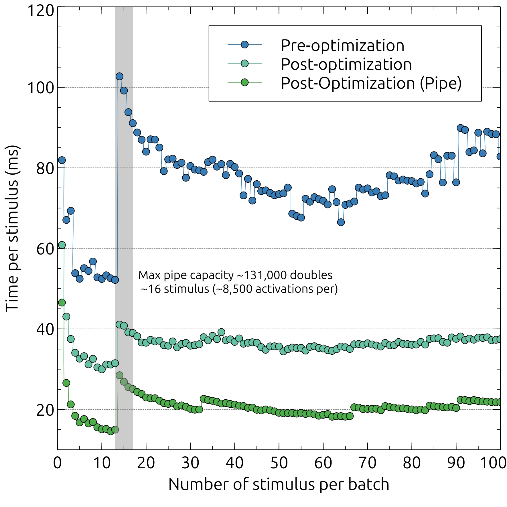

# Spiking Neural Network in C++

## Python API

Clone the repository

```bash
git clone https://github.com/samp5/ha141.git snn
```

Initialize the Pybind11 submodule with 

```bash
cd snn
git submodule update --init
```

Create the python library with

```bash 
make pybind
```

This will create a python package is `snn/extern`.

Create a virtual enviroment (if you want) and install the necessary dependencies

```bash
cd extern
mkdir venv
python3 -m venv ./venv
source venv/bin/activate
pip install networkx numpy pandas scikit-learn
```

Create the neccessay local directories

```bash
mkdir run_config
```

`./extern/run_config` holds  `toml` files that specify runtime parameters for the network. If an empty string is specified in the initial arguement list passed to `snn.pySNN(args: [str])`, `base_config.toml` is used or created and used if it does not exist.

> [!NOTE] 
> Alternative initialization parameters exist that do not require this directory and the usage of `toml` files. 
> See [Constructing a Network](#network-constructors)


### Python interface and usage

- The `snn` module has a small interface but deep functionality.
 
#### Network Constructors

##### `pySNN(dict: dict[string : double] = DEFAULT_DICT)`

- The easier way to construct a SNN object.

- A copy of a default dictionary can be obtained via the static member funciton
`pySNN.getDefaultConfig() -> dict[string: double]`

- If no dictionary is specified, the following is used (and is the same returned by `getDefaultConfig`)

```c++
  ConfigDict dict = {{"neuron_count", 0}, // determine by later networkX graph
                     {"input_neuron_count", 0}, // determined by stimulus or pySNN::initialize
                     {"group_count", 1}, // ALWAYS
                     {"edge_count", 0},  // determined by later networkX graph
                     {"refractory_duration", 5},  // Mod
                     {"initial_membrane_potential", -6.0}, // Mod
                     {"activation_threshold", -5.0}, // Mod
                     {"refractory_membrane_potential", -7.0}, // Mod
                     {"tau", 100.0}, // Mod
                     {"max_latency", 10}, // Mod
                     {"max_synapse_delay", 2}, // MUST BE SET PRIOR TO INITIALIZATION
                     {"min_synapse_delay", 1}, // MUST BE SET PRIOR TO INITIALIZATION
                     {"max_weight", 1.0}, // determined by later networkX graph 
                     {"poisson_prob_of_success", 0.8}, // Mod
                     {"time_per_stimulus", 200}, // Mod
                     {"seed", -1}}; // uses System time

```

Some of the above values are 0 and any change to this value will be overwritten when the network is intialized by `pySNN.initialze(adjacencyDict)`

Any key value pair marked with `// Mod` is easily modifiable post-initialization via the mutators detailed in [Accessors and Mutators](#accessors-and-mutators-for-configuration-variables). 

The function `pySNN.updateConfig(dict: dict[string: double])` can be used in place of calling multiple mutators.

> [!NOTE] 
> Max and min synapse delay must be set prior to initialization and will not affect the network's behavior if altered later.

> [!WARNING] 
> Altering the number of groups results in erroneous network behavior and is a work in progress


##### `pySNN(configFile: string)`

- Expects to find `configFile` in `./extern/run_config/`
- Passing an empty string will generate a `base_config.toml` in the `./extern/run_config/` folder

- Returns a spiking neural network object with parameters set in the toml file.

```python
import snn

net = snn.pySNN("my_custom_config.toml")

```

#### Network initialization
##### `pySNN.initialize( adjacencyDict : dict[tuple[int, int] : dict[tuple[int, int] : dict[string : float]]],  numberInput : int | stimulus : numpyArray )`

###### A note on the adjacencyDict:
- The adjacencyDict should be a dictionary with the following structure
```
{
   (0,0) : {
            (0,1) : {
                    "weight" : 1.0
                    "delay" : 1.0
                    }
            (0,2) : {
                    "weight" : 2.0
                    "delay" : 1.0
                    }

            }
   (0,1) : {
            (1,1) : {
                    "weight" : 1.0
                    "delay" : 2.0
                    }
            (0,2) : {
                    "weight" : 2.0
                    "delay" : 1.0
                    }

            }
    ...
}
```
> [!NOTE] 
> The final dictionary layer keys, `weight` and `delay` are optional and if omitted, will be randomly deteremined via a random number generator


The function is overloaded to accept an adjacencyDict **and** either a
1. Numpy array. This automatically detemines the number of input neurons from the number of stimulus inputs in a single dimension of the array (the number of columns)
2. Integer representing the desired number of input neurons.

> [!IMPORTANT]
> For size $n$ stimulus with $m$ input neurons
> Only the first $m$ stimulus inputs will be read.

The `adjacencyDict` can be automatically generated from `networkx` as long as the Graph is a **directed grid**

###### Example usage

```python
import networkx as nx
import numpy as np
G = nx.navigable_small_world_graph(10, seed=1)

# since a directed grid is NOT weighted, you have to add weights
# optionally add delays
for n in G:
    for nbr in G[n]:
        G[n][nbr]["weight"] = random.random()
        G[n][nbr]["delay"] = random.randint(2, 10)

stimulus = np.array([[1.0,1.0,1.0,1.0,1.0,1.0,1.0,1.0,1.0],
                     [1.0,1.0,1.0,1.0,1.0,1.0,1.0,1.0,1.0],
                     [1.0,1.0,1.0,1.0,1.0,1.0,1.0,1.0,1.0],
                     [1.0,1.0,1.0,1.0,1.0,1.0,1.0,1.0,1.0],
                     [1.0,1.0,1.0,1.0,1.0,1.0,1.0,1.0,1.0]])

net = snn.pySNN(); # Create the network
net.initialize(nx.to_dict_of_dicts(G), stimulus) # initialize the network

net.runBatch(stimulus[0:2]) # Run the batch
activation = net.getActivation() # Get activation
net.batchReset()
```


#### Other Network Operations
##### `pySNN.updateWeights( adjacencyDict : dict[tuple[int, int] : dict[tuple[int, int] : dict[string : float]]] )`

Does two things:

1. Updates synapse weight for connection between `(x,y)` and `(a,b)` based on `adjacencyDict[(x,y)][(a,b)]["weight"]`
2. Updates synapse delay for connection between `(x,y)` and `(a,b)` based on `adjacencyDict[(x,y)][(a,b)]["delay"]`

##### `pySNN.runBatch(buffer : numpy array)`

Starts a child process of the network in order to run the given stimulus set.

##### `pySNN.getActivation() -> numpyArray`

Outputs a numpy array with "time per stimulus" columns and "number of stimulus" rows

#### `pySNN.batchReset()` 

Reset the network to be ready to run another batch.

> [!WARNING] 
> Thi will delete any logging data held in the network. Be sure to call `pySNN.getActivation()` before reseting for another batch to avoid overwritting your activation data.

#### Example usage

```python
import snn
import networkx as nx
import time
import random
from datetime import datetime
import numpy as np

images = [[1.0,1.0,1.0,1.0,1.0,1.0,1.0,1.0,1.0],
          [2.0,2.0,2.0,2.0,2.0,2.0,2.0,2.0,2.0],
          [3.0,3.0,3.0,3.0,3.0,3.0,3.0,3.0,3.0],
          [4.0,4.0,4.0,4.0,4.0,4.0,4.0,4.0,4.0], 
          [5.0,5.0,5.0,5.0,5.0,5.0,5.0,5.0,5.0]]
dataset = "dummy"
v = 0
images = np.array(images)


print("-> NetworkX generating graph...")
start = time.time()
G = nx.navigable_small_world_graph(10, seed=1)
end = time.time()
print(f"-> Done, took {(end - start):.5f} seconds")

print("-> Generating random edge weights and delays...")
for n in G:
    for nbr in G[n]:
        G[n][nbr]["weight"] = random.random() * 10
        G[n][nbr]["delay"] = random.randint(1, 11)


print("-> Starting network...")
net = snn.pySNN()
net.initialize(nx.to_dict_of_dicts(G), images)
start = time.time()
net.runBatch(images)
end = time.time()

print(f"-> Done, took {(end - start):.5f} seconds")

print("-> Fetching data from network")
out = net.getActivation()
print("-> Done")

filestr = datetime.now().strftime("%m%d_%H%M")
print(f"-> Writing to file {dataset}v{v}_{filestr}.csv")
np.savetxt(f"{dataset}v{v}_{filestr}.csv", out,delimiter=",", fmt = '%d')
print("-> Done")

```

<details>
<summary>Output stored in <code>dummyv0_0726_1142.csv</code></summary>
<br>

```csv
4,3,8,2,1,0,5,7,5,1,1,0,9,6,3,1,0,9,6,0,3,1,0,0,0,0,0,0,5,8,6,0,0,0,0,0,9,7,3,0,0,0,0,9,7,3,0,0,0,9,7,3,0,0,9,7,3,0,0,0,0,4,3,4,6,0,4,3,4,1,0,5,0,1,3,6,5,0,1,3,0,2,0,0,9,3,3,0,0,0,0,0,0,0,0,0,0,0,9,5,0,1,0,0,0,4,8,3,0,0,0,9,5,1,0,0,9,5,1,1,0,1,0,5,2,6,1,1,1,5,2,2,1,0,0,0,0,0,9,4,0,2,2,0,0,5,6,6,1,1,5,2,5,5,0,5,2,5,1,0,4,5,2,5,1,0,9,2,5,1,0,0,0,9,6,2,0,0,9,0,6,2,0,0,0,0,5,7,5,0,0,0,9,6,2,0,0,9,6,0
4,3,5,2,4,4,3,4,2,4,4,3,4,1,5,4,3,4,1,5,0,0,4,3,4,1,0,0,9,5,3,0,0,0,0,9,6,2,0,0,9,6,2,0,0,9,6,2,0,0,9,6,2,0,0,9,6,2,0,0,9,6,2,0,0,9,0,6,2,0,0,9,6,3,0,0,9,6,3,0,0,0,9,6,3,0,0,9,6,3,0,0,9,6,3,1,0,0,9,0,6,3,1,0,9,6,3,1,0,9,6,3,1,0,9,6,3,1,0,9,6,3,1,0,9,6,3,1,0,0,9,6,3,0,1,0,0,0,9,7,3,0,0,9,7,3,0,0,0,9,7,3,0,0,9,7,3,0,0,9,7,3,0,0,9,7,0,3,0,0,0,9,7,3,0,0,0,9,7,3,0,0,9,7,3,0,0,9,7,3,0,0,9,7,3,0,0,9,7,0
4,3,5,2,4,4,3,4,2,4,4,3,4,1,5,4,3,4,1,5,0,0,4,3,4,1,0,0,9,5,3,0,0,0,9,6,2,0,0,9,0,6,2,0,0,9,6,2,0,0,9,6,2,0,0,9,6,2,0,0,9,6,2,0,0,9,6,2,0,0,9,6,2,0,0,9,6,2,0,0,0,0,9,6,2,0,0,9,6,2,0,0,9,6,2,0,0,0,9,6,3,0,0,9,6,3,0,0,9,6,3,0,0,9,6,3,0,0,9,0,6,3,0,0,9,6,3,0,0,0,9,6,3,0,0,0,0,9,6,3,1,0,9,6,3,1,0,0,9,6,3,1,0,9,6,3,1,0,9,0,6,3,1,0,9,6,3,1,0,0,9,6,3,1,0,0,9,6,3,1,0,9,6,3,1,0,9,6,3,1,0,9,6,3,1,0,9,6,3,0
4,3,5,2,4,4,3,5,3,4,4,3,5,2,5,4,3,5,2,5,0,0,4,3,5,2,0,0,9,5,4,1,0,0,0,9,6,3,1,0,9,6,3,1,0,9,6,3,1,0,9,6,3,1,0,9,6,3,1,0,9,6,3,1,0,9,0,6,3,1,0,9,6,3,1,0,9,6,3,1,0,0,9,6,3,1,0,9,6,3,1,0,9,6,3,1,0,0,9,0,6,3,1,0,9,6,3,1,0,9,6,3,1,0,9,6,3,1,0,9,6,3,1,0,9,6,3,1,0,0,9,6,3,0,1,0,0,0,9,7,3,0,0,9,7,3,0,0,0,9,7,3,0,0,9,7,3,0,0,9,7,3,0,0,9,7,0,3,0,0,0,9,7,3,0,0,0,9,7,3,0,0,9,7,3,0,0,9,7,3,0,0,9,7,3,0,0,9,7,0
4,0,0,0,4,7,5,2,1,4,7,5,2,0,5,7,5,2,0,5,3,4,5,0,0,0,0,0,9,6,2,0,0,0,0,9,6,2,0,0,9,6,2,0,0,9,6,2,0,0,9,6,2,0,0,9,6,4,0,0,9,6,4,0,0,9,0,6,4,0,0,9,6,4,0,0,9,6,4,0,0,0,9,7,3,0,0,9,7,3,0,0,9,7,3,0,0,0,9,0,7,3,0,0,9,7,3,0,0,9,7,3,0,0,9,7,3,0,0,9,7,3,0,0,9,7,3,0,0,0,9,7,3,0,0,0,0,0,9,7,3,0,0,9,7,3,0,0,0,9,7,3,0,0,9,7,3,0,0,9,7,3,0,0,9,7,0,3,0,0,0,9,7,3,0,0,0,9,7,3,0,0,9,7,3,0,0,9,7,3,0,0,9,7,3,0,0,9,7,0
```

</details>


#### Accessors and Mutators for Configuration variables


<details>
<summary><code>pySNN.setProbabilityOfSuccess(pSuccess: float)</code></summary>
<br>

- Sets the probability of success for input neurons 
    - For a time per stimulus of 100ms and probability of success of 0.5, on average, input neurons will recieve 50 stimulus events.

- Accessor: `getProbabilityOfSucess()`

</details>

<details>
<summary><code>pySNN.setMaxLatency(mLatency: int, update = true : bool)</code></summary>
<br>


- The latency of an input neuron is calculated via their distance the the "center" of an image. 
- For an image with dimensions 5 x 5, and a maximum latency of 10ms input neurons at each "corner" of the image will have a latency of 10ms whereas those in the center will have a latency of (integer rounding) 0. 
- The latency for a given input neuron is calculated as follows:
    1. The index of the input neuron is transformed into a coordinate as if the 1-D stimulus was a 2-D square (or a rectangle of the smallest perimeter)
    2. The distance of the input neuron to the center of the image is calculated
    3. The latency of the input neuron is $d_{\textrm{input}}/d_{\textrm{max}} \times$ `max_latency` interpretted as an integer
- Becuase the image is stored in memory, the default argument `update` rebuilds the image and updates the latency data member of all `InputNeurons`. If for some reason you do not want the latency to be immediately updated, `False` can be specified

- Accessor: `pySNN.getProbabilityOfSucess()`

</details>

<details>
<summary><code>pySNN.setTau(Tau: float)</code></summary>
<br>

- Sets tau, which is used to calculate the decay rate of the membrane potential of a neuron according to

$$    \frac{dV}{dt} = \frac{V(t) - V_{\textrm{rest}}}{\tau} $$
Where $V_{\textrm{rest}}$ is the refractory membrane potential

- Accessor: `pySNN.getTau()`

</details>

<details>
<summary><code>pySNN.setRefractoryDuration(duration: int, update = true : bool)</code></summary>
<br>


- Sets the length of time for which a neuron will not acknowledge messages after firing

- Becuase some frequently accesses configuration variables are copied and stored as `Neuron` data members,  the default argument `update` calls the approapriate mutators and updates these values. If for some reason you do not want the values to be immediately updated, `False` can be specified

- Accessor: `pySNN.getRefractoryDuration()`

</details>

<details>
<summary><code>pySNN.setRefractoryMembranePotential(refractoryMembranePotential: float, update = true: bool);</code></summary>
<br>


-  Set the membrane potential each neuron is set to after firing

- Becuase some frequently accesses configuration variables are copied and stored as `Neuron` data members,  the default argument `update` calls the approapriate mutators and updates these values. If for some reason you do not want the values to be immediately updated, `False` can be specified

- Accessor: `pySNN.getRefractoryMembranePotential()`

</details>

<details>
<summary><code>pySNN.setTimePerStimulus(timePerStimulus: int)</code></summary>
<br>

- Sets the simuluated length of time each stimulus recieves

> [!NOTE] 
> This will linearly increase runtime

- Accessor: `pySNN.getTimePerStimulus()`

</details>

<details>
<summary><code>pySNN.setSeed(seed: int)</code></summary>
<br>


- Seeds random number generator
    - Uses Mersenne Twister random number generator ([`std::mt19937`](https://cplusplus.com/reference/random/mt19937/))
  
</details>

<details>
<summary><code>pySNN.setInitialMembranePotential(initialMembranePotential: float)</code></summary>
<br>

- Sets the membrane potential that initializes each `Neuron`

- Accessor: `pySNN.getInitialMembranePotential()`

</details>

<details>
<summary><code>pySNN.setActivationThreshold(activationThreshold: float, update = True: bool)</code></summary>
<br>


- Sets the membrance potential at which a neuron will fire

- Becuase some frequently accesses configuration variables are copied and stored as `Neuron` data members,  the default argument `update` calls the approapriate mutators and updates these values. If for some reason you do not want the values to be immediately updated, `False` can be specified

- Accessor: `pySNN.getActivationThreshold()`


</details>

### Optimal batch sizes

Batch size has little effect on runtime per stimulus, except for small batches with "normal" activation levels.

The following graph shows runtimes for the MNIST data set for a network of ~8000 neurons where total activation for the network for each stimulus ~20,000 activations.

The jump in runtime per stimulus around 15 stimuli is due to read write operations to a pipe beween parent and child processes. (For small batches the pipe capacity is smaller than the total amount of data passed).





## C++
To run the network:
- Clone the repository

```bash
git clone https://github.com/samp5/ha141.git snn

```

- Create the following directories in the root folder of the repo
```bash
cd snn
mkdir build logs run_config
```

- Build the executable
```bash
make build
```

- Run the network
```bash
make run

```
If it doesn't already exist this will create a `base_config.toml` file in `run_config/`. If you want to run the network on a different config use `build/snn <filename>.toml`
```bash
build/snn my_custom_config.toml
```
All other options are specified in config file


